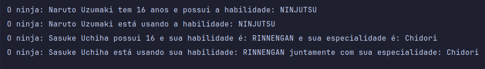

# Desafios Java10x - Interfaces e Polimorfismo
___

- Essa *Branch* está destinada para a resolução dos desafio propostos pelo curso de [Batismo de Java](https://batismodejava.dev/).
- O desafio consiste em:
  - Criar uma ***Interface Ninja*** e implementar nas classes.
  - A interface deve ter os métodos: `mostarInformacoes()` e `executarHabilidade()`
  - Criar a **Classe NinjaBasico** e implementar a ***Interface Ninja***
  - Criar a **Classe NinjaAvancado** e implementar a ***Interface Ninja***
  - Criar um *ENUM* para os atributo de *Habilidade*

## Resultado

