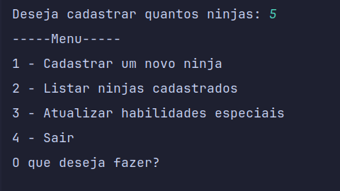
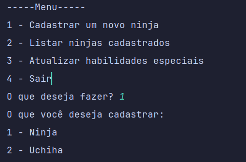
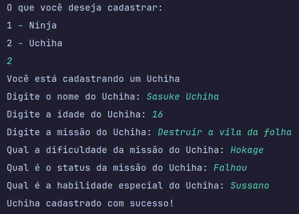
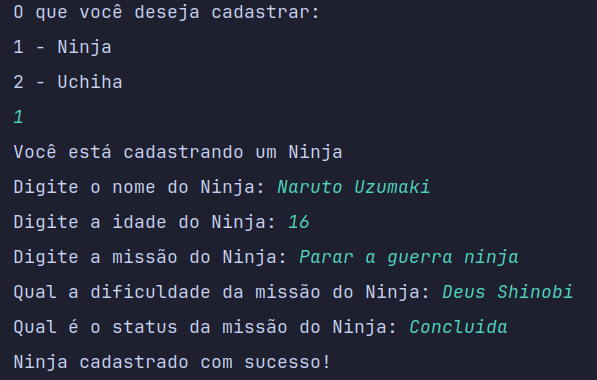
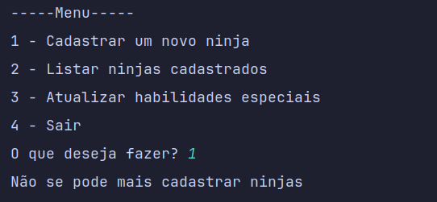

# Desafios Java10x - Cadastro Ninja com Herança
___

- Essa *Branch* está destinada para a resolução dos desafio propostos pelo curso de [Batismo de Java](https://batismodejava.dev/).
- O desafio consiste em:
  - Criar uma **Classe Ninja**
  - Criar uma classe ***Uchiha*** que herda da **Classe Ninja**
  - A ***Classe Uchiha*** deve ter um atributo `String habilidadeEspecial`
  - A ***Classe Uchiha*** deve ter um método para exibir a `habilidadeEspecial`
  - Deve ser *sobreescrito* o método da **Classe Ninja** `mostrarInformacoes()`

## Imagens
- Inicio do Programa:
 

---
- Ao Escolher a opção de cadastrar um novo ninja:
 

---
- Ao Escolher o tipo *Uchiha*:
 

---
- Ao Escolher o tipo *Ninja*:
 
- 
---
- Cadastrar ninjas além do número escolhido no inicio do programa:
 
- 
---
- Listar ninjas cadastrados
 
- 
---
- Entre outras verificações...